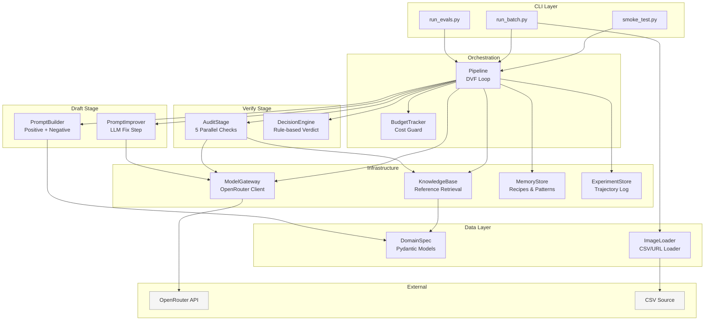

# C4 Component Diagram

Детализация внутренних компонентов и их взаимодействий.

## Component Details

### Orchestration Layer
- **Pipeline** --- основной DVF loop. Координирует Draft/Verify/Fix. Управляет итерациями и бюджетом.
- **BudgetTracker** --- считает расходы по `COST_PER_CALL`. Hard stop при превышении `BUDGET_PER_RUN`.

### Draft Stage
- **PromptBuilder** --- собирает промпт из scene + object + domain style + reject hints. Используется только в generate mode.
- **PromptImprover** --- LLM call для улучшения промпта/инструкции на основе audit failures и memory hints. Fail-safe: возвращает исходный промпт при ошибке.

### Verify Stage
- **AuditStage** --- 5 параллельных проверок. Safety check блокирующий (выполняется первым). Остальные 4 --- concurrent. Structured error codes.
- **DecisionEngine** --- детерминистическая агрегация scores. Weighted average + per-check minimums. Без LLM.

### Infrastructure Layer
- **ModelGateway** --- единый клиент OpenRouter. 4 метода: `chat`, `vision`, `generate_image`, `edit_image`. 3-level fallback.
- **KnowledgeBase** --- retriever из reference_annotations. Similarity ranking, few-shot prompt hints.
- **MemoryStore** --- JSON persistence. Recipes (best prompts), reject patterns (counters), global stats.
- **ExperimentStore** --- filesystem logging. `meta.json`, `prompt.json`, `image.png`, `audit_result.json`, `trajectory.jsonl` per iteration.

### Data Layer
- **DomainSpec** --- Pydantic-модели для всех YAML конфигураций. Type-safe access.
- **ImageLoader** --- CSV reader с auto-detect URL column. Async download через httpx.
