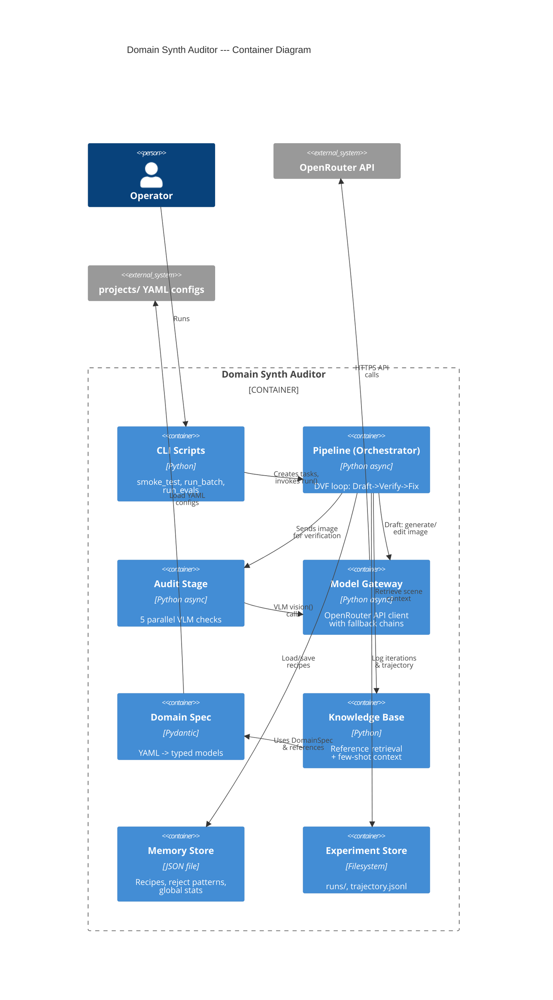

# C4 Container Diagram

Основные контейнеры (процессы, хранилища) системы.

## Container Responsibilities

| Container | Responsibility | Technology |
|-----------|---------------|------------|
| **CLI Scripts** | Entry points, argument parsing, project switching | argparse, asyncio.run() |
| **Pipeline** | DVF orchestration, budget tracking, iteration control | async, BudgetTracker |
| **Audit Stage** | Parallel VLM checks, rule-based checks, score aggregation | asyncio.gather(), PIL |
| **Model Gateway** | API calls with fallback, response parsing, image extraction | AsyncOpenAI, httpx |
| **Domain Spec** | YAML parsing, Pydantic validation, type-safe config access | Pydantic v2, PyYAML |
| **Knowledge Base** | Reference retrieval, similarity ranking, prompt hint generation | In-memory search |
| **Memory Store** | Cross-run persistence: recipes, reject patterns, stats | JSON read/write |
| **Experiment Store** | Run logging, iteration artifacts, trajectory JSONL | Filesystem I/O |
