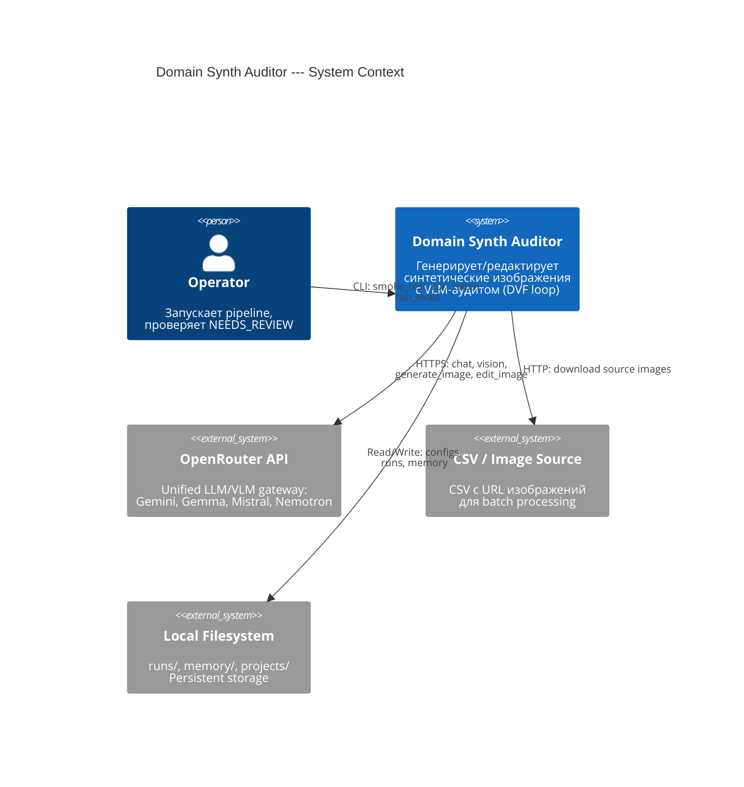

# C4 Context Diagram

Верхнеуровневое представление системы и её внешних зависимостей.

## Actors

| Actor | Role |
|-------|------|
| **Operator** | Запускает pipeline через CLI скрипты, задаёт параметры, проверяет результаты |
| **OpenRouter API** | Единый API для всех LLM/VLM вызовов (text, vision, image gen/edit) |
| **CSV / Image Source** | Внешние изображения для edit mode (HTTP URLs) |
| **Local Filesystem** | Хранение конфигураций, результатов runs, persistent memory |
