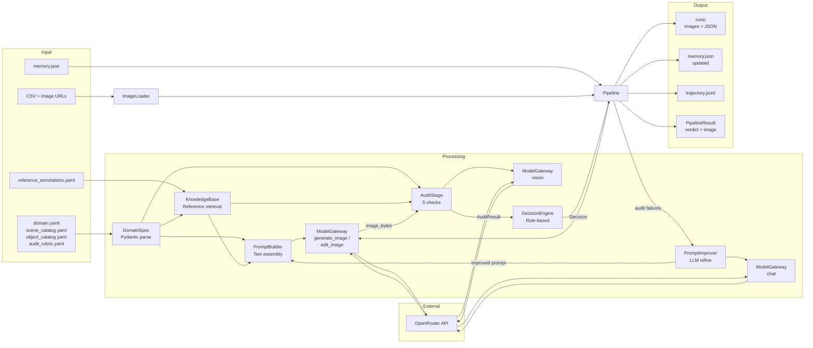
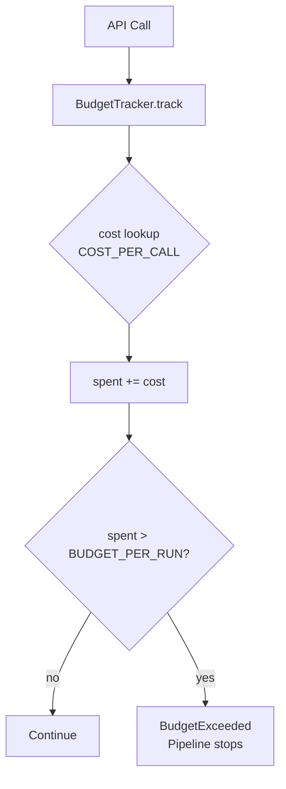

# Data Flow Diagram

## Token & Data Flow

## Data Types at Boundaries

| Boundary | Data Type | Format |
|----------|-----------|--------|
| YAML -> DomainSpec | Domain config | YAML -> Pydantic models |
| CSV -> ImageLoader | Image records | CSV + HTTP download -> `ImageRecord` |
| Pipeline -> ModelGateway | Prompts / images | `str` / `bytes` |
| ModelGateway -> OpenRouter | API request | JSON (OpenAI-compatible) |
| OpenRouter -> ModelGateway | API response | JSON with text / image data-URL / image URL |
| AuditStage -> DecisionEngine | Check results | `AuditResult` (list of `CheckResult`) |
| Pipeline -> MemoryStore | Recipes & patterns | Python dict -> JSON file |
| Pipeline -> ExperimentStore | Run artifacts | JSON files + PNG images + JSONL trajectory |

## Budget Flow

