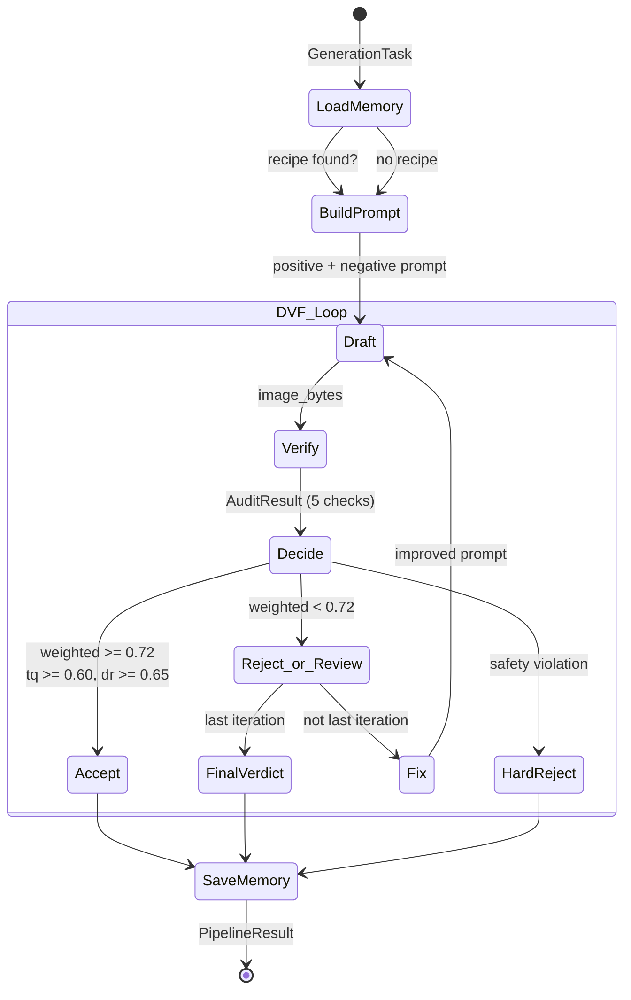
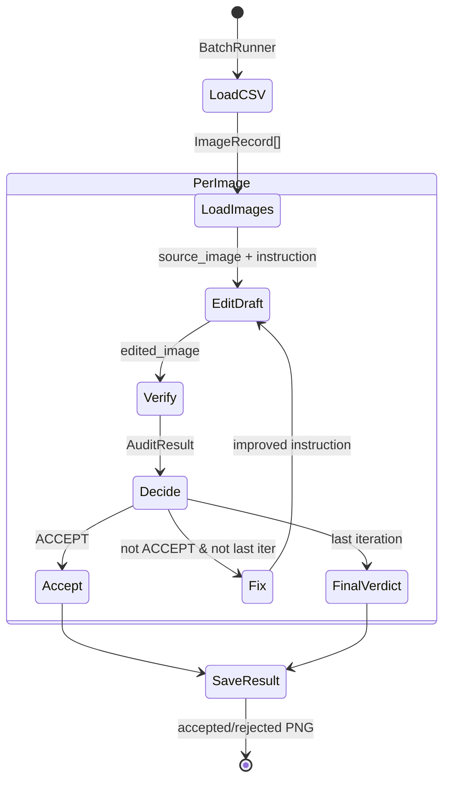
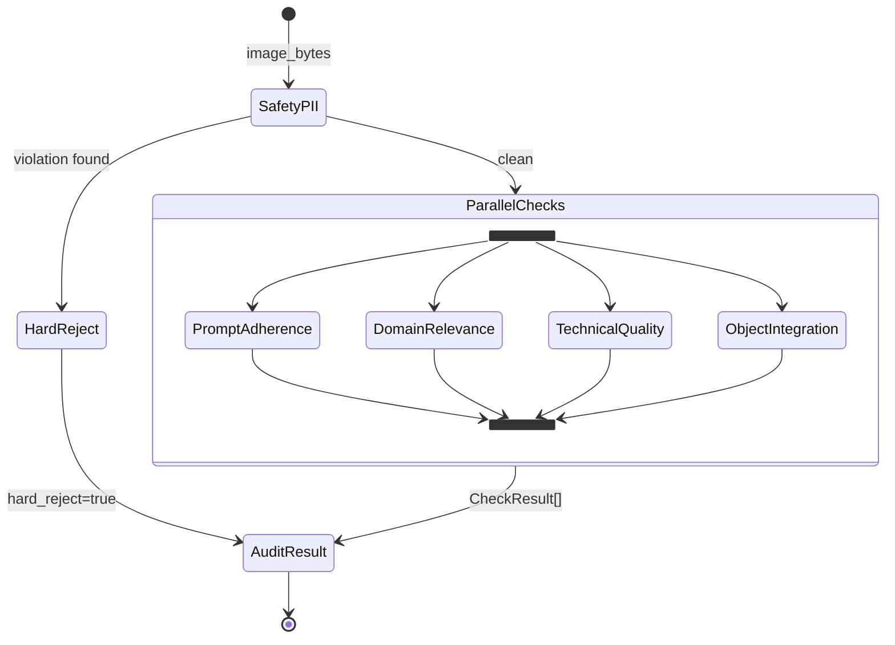
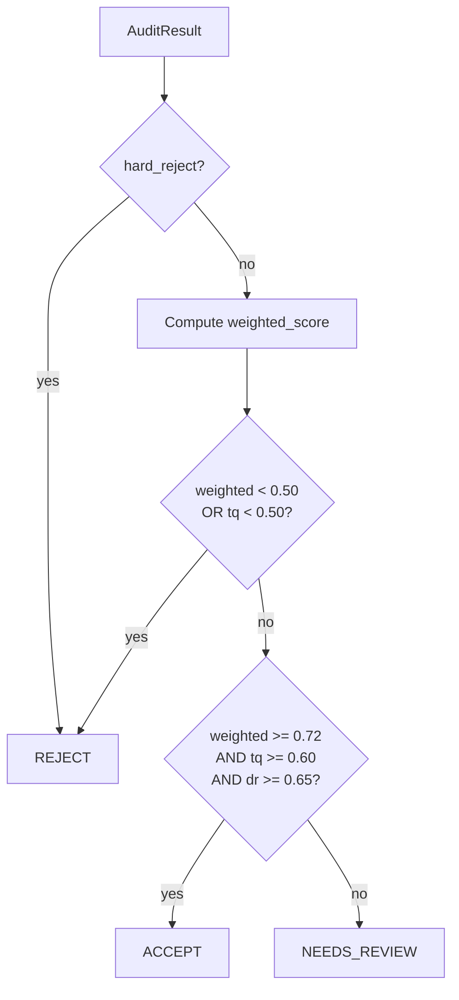
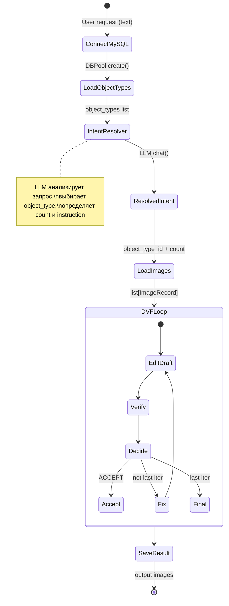

# Workflow Diagram (DVF Pipeline)

## Generate Mode

```mermaid
stateDiagram-v2
    [*] --> LoadMemory: GenerationTask

    LoadMemory --> BuildPrompt: recipe found?
    LoadMemory --> BuildPrompt: no recipe

    BuildPrompt --> Draft: positive + negative prompt

    state DVF_Loop {
        Draft --> Verify: image_bytes
        Verify --> Decide: AuditResult (5 checks)

        Decide --> Accept: weighted >= 0.72<br/>tq >= 0.60, dr >= 0.65
        Decide --> Reject_or_Review: weighted < 0.72
        Decide --> HardReject: safety violation

        Reject_or_Review --> Fix: not last iteration
        Reject_or_Review --> FinalVerdict: last iteration

        Fix --> Draft: improved prompt
    }

    Accept --> SaveMemory
    FinalVerdict --> SaveMemory
    HardReject --> SaveMemory

    SaveMemory --> [*]: PipelineResult
```

## Edit Mode

```mermaid
stateDiagram-v2
    [*] --> LoadCSV: BatchRunner

    LoadCSV --> LoadImages: ImageRecord[]

    state PerImage {
        LoadImages --> EditDraft: source_image + instruction
        EditDraft --> Verify: edited_image
        Verify --> Decide: AuditResult

        Decide --> Accept: ACCEPT
        Decide --> Fix: not ACCEPT & not last iter
        Fix --> EditDraft: improved instruction

        Decide --> FinalVerdict: last iteration
    }

    Accept --> SaveResult
    FinalVerdict --> SaveResult
    SaveResult --> [*]: accepted/rejected PNG
```

## Audit Stage Detail

```mermaid
stateDiagram-v2
    [*] --> SafetyPII: image_bytes

    SafetyPII --> HardReject: violation found
    SafetyPII --> ParallelChecks: clean

    state ParallelChecks {
        state fork <<fork>>
        state join <<join>>

        fork --> PromptAdherence
        fork --> DomainRelevance
        fork --> TechnicalQuality
        fork --> ObjectIntegration

        PromptAdherence --> join
        DomainRelevance --> join
        TechnicalQuality --> join
        ObjectIntegration --> join
    }

    ParallelChecks --> AuditResult: CheckResult[]
    HardReject --> AuditResult: hard_reject=true

    AuditResult --> [*]
```

## Decision Logic

```mermaid
flowchart TD
    A[AuditResult] --> B{hard_reject?}
    B -->|yes| C[REJECT]
    B -->|no| D[Compute weighted_score]

    D --> E{weighted < 0.50<br/>OR tq < 0.50?}
    E -->|yes| C

    E -->|no| F{weighted >= 0.72<br/>AND tq >= 0.60<br/>AND dr >= 0.65?}
    F -->|yes| G[ACCEPT]
    F -->|no| H[NEEDS_REVIEW]
```

## DB Mode (Natural Language → Pipeline)

```mermaid
stateDiagram-v2
    [*] --> ConnectMySQL: User request (text)

    ConnectMySQL --> LoadObjectTypes: DBPool.create()
    LoadObjectTypes --> IntentResolver: object_types list

    IntentResolver --> ResolvedIntent: LLM chat()
    note right of IntentResolver: LLM анализирует запрос,\nвыбирает object_type,\nопределяет count и instruction

    ResolvedIntent --> LoadImages: object_type_id + count
    LoadImages --> DVFLoop: list[ImageRecord]

    state DVFLoop {
        [*] --> EditDraft
        EditDraft --> Verify
        Verify --> Decide
        Decide --> Accept: ACCEPT
        Decide --> Fix: not last iter
        Fix --> EditDraft
        Decide --> Final: last iter
    }

    DVFLoop --> SaveResult
    SaveResult --> [*]: output images
```
